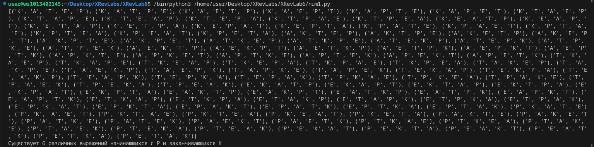
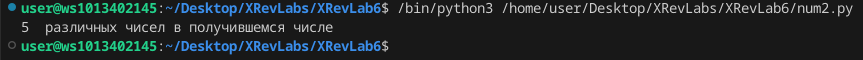
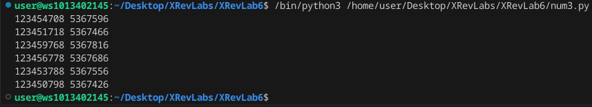

# Лабораторная работа №3
### Задание
    Вариант 8

    1. Рассматриваются символьные последовательности длины 6  в пятибуквенном алфавите {К, А, Т, Е, Р}. Сколько существует таких последовательностей, которые начинаются с буквы Р и заканчиваются буквой К?

    2. Значение выражения 2166+2164+366−614−24 216^6 + 216^4 + 36^6 − 6^{14} − 24 2166+2164+366−614−24 записали в системе счисления с основанием 6. Сколько различных цифр содержит эта запись?

    3. Назовём маской числа последовательность цифр, в которой также могут встречаться следующие символы:

        символ ? означает ровно одну произвольную цифру;

        символ * означает любую последовательность цифр произвольной длины; в том числе * может задавать и пустую последовательность.

    Например, маске 123*4?5 соответствуют числа 123405 и 12365485.

    Среди натуральных чисел, не превышающих 109, найдите все числа, соответствующие маске 12345?7?8, делящиеся на число 23 без остатка.

    Запишите в первом столбце таблицы все найденные числа в порядке возрастания, а во втором столбце  — соответствующие им результаты деления этих чисел на 23.

### Описание проделанной работы
Написал программы по варианту 8
Оформил отчёт в файле readme.md

#### Инструкция по запуску
1. Открыть папку XRevLab6 с помощью VSCodium
2. Вызвать консоль и прописать `gcc num1/num2/num3.c -o result` 
3. прописать в консоли `./result` 

### Вывод программы
## num1

## num2

## num3

### Ссылки
1. https://evil-teacher.on.fleek.co/prog_pm/term1/lab03/